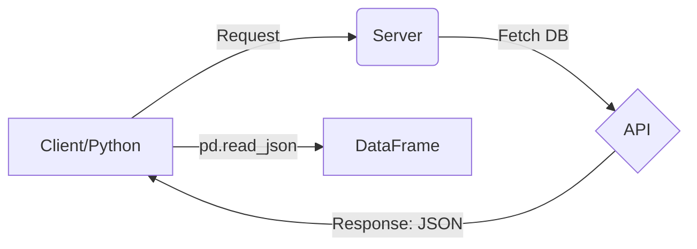

# 📊 Working with JSON and SQL in Pandas

Welcome to Day 16 of the **100 Days of Machine Learning** series. Today, we delve into two of the most critical data formats in the industry: **JSON** and **SQL**. Understanding how to ingest this data into a Pandas DataFrame is a foundational skill for any Data Scientist or Machine Learning Engineer.

---

## 1. JavaScript Object Notation (JSON)

### What is JSON?

JSON is a lightweight, text-based, language-independent data interchange format. It is easy for humans to read and write and easy for machines to parse and generate.

#### Why is it Universal?

JSON is the standard format for data transfer in web APIs. Whether your server is running Java, Python, or Node.js, they can all communicate using JSON.

**The API Workflow:**



### Reading Local JSON Files

Pandas provides a very straightforward method: `pd.read_json()`.

```python
import pandas as pd

# Basic usage
df = pd.read_json('train.json')
df.head()
```

### Reading JSON from a URL

One of the most powerful features of Pandas is the ability to fetch JSON data directly from a live API endpoint.

```python
# Example: Fetching live currency exchange rates
url = 'https://api.exchangerate-api.com/v4/latest/INR'
df_live = pd.read_json(url)
df_live.head()
```

---

## 2. Structured Query Language (SQL)

In professional environments, data rarely sits in flat files like CSVs. It is usually stored in Relational Databases (RDBMS) like MySQL, PostgreSQL, or SQL Server.

### The Setup (Local Environment)

To practice, we use **XAMPP** to simulate a local database server:

1. **Start Apache & MySQL** in the XAMPP Control Panel.
2. **Access phpMyAdmin**: Go to `http://localhost/phpmyadmin`.
3. **Create Database**: Create a database named `world`.
4. **Import Data**: Import your `.sql` file into the database.

### Connecting Python to MySQL

To bridge Python and MySQL, we need the `mysql-connector-python` library.

**Installation:**

```bash
pip install mysql-connector-python
```

**Establishing Connection:**

```python
import mysql.connector

# Connect to the database
conn = mysql.connector.connect(
    host='localhost',
    user='root',
    password='',
    database='world'
)
```

### Reading SQL into Pandas

We use `pd.read_sql_query()` to execute SQL commands and store the result directly in a DataFrame.

```python
# Basic Select Query
query = "SELECT * FROM city"
df_city = pd.read_sql_query(query, conn)

# Advanced Query with Filtering
query_filtered = "SELECT * FROM city WHERE CountryCode = 'USA'"
df_usa = pd.read_sql_query(query_filtered, conn)

# Query with multiple conditions
query_complex = "SELECT * FROM country WHERE LifeExpectancy > 60"
df_high_life = pd.read_sql_query(query_complex, conn)
```

---

## 3. Advanced Concepts & Optimization

As you move from beginner to advanced, you need to consider performance and memory management.

| Parameter                 | Function                                                                                     |
| :------------------------ | :------------------------------------------------------------------------------------------- |
| **`chunksize`**   | Reads data in smaller batches. Essential for massive JSON/SQL datasets to avoid RAM crashes. |
| **`parse_dates`** | Automatically converts specific columns into DateTime objects during ingestion.              |
| **`index_col`**   | Sets a specific column (like `ID`) as the index of the DataFrame.                          |
| **`encoding`**    | Handles special characters (e.g.,`utf-8`).                                                 |

### Example: Using `chunksize` for Large SQL Data

```python
# Returns an iterator instead of a full DataFrame
chunk_iterator = pd.read_sql_query("SELECT * FROM city", conn, chunksize=1000)

for chunk in chunk_iterator:
    # Process each 1000-row block individually
    print(chunk.shape)
```

---

## 🌍 Real-World Applications

1. **Web Scraping & APIs**: Scrape data from a website or pull it from a financial API (JSON).
2. **Enterprise Data Analysis**: Query a company's customer database (SQL) to find buying patterns.
3. **Microservices**: Fetching configuration or state data from other services via JSON.

---

## 📝 Quick Revision

- **JSON** is the language of the web (APIs). Use `pd.read_json()`.
- **SQL** is the language of databases. Use `pd.read_sql_query()` along with a connection object.
- **mysql-connector-python** is the bridge between Python and MySQL.
- Always use **`chunksize`** when working with very large datasets to save memory.
- SQL filtering (using `WHERE`) is more efficient than loading all data and filtering in Pandas because the database engine does the heavy lifting before the data enters Python.

---
