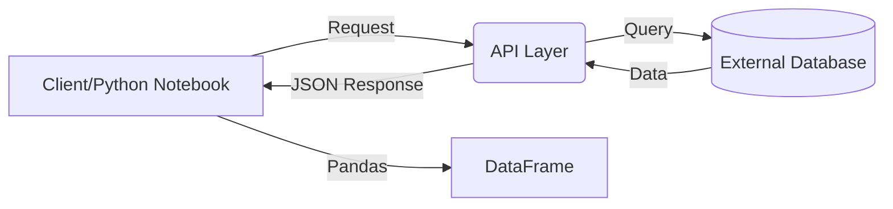

# 🌐 Fetching Data from APIs to Pandas DataFrame

Welcome to Day 17 of the **100 Days of Machine Learning** series. In this session, we learn how to fetch live data from external websites using **APIs** and convert that data into a structured **Pandas DataFrame**.

---

## 1. What is an API?

An **API (Application Programming Interface)** is a software intermediary that allows two applications to talk to each other.

### The Real-World Analogy: Railway Reservation

Imagine you want to book a train ticket. You can use:

* **IRCTC** (The source database)
* **MakeMyTrip**
* **Yatra**
* **ConfirmTkt**

MakeMyTrip and Yatra are different companies with different databases. How do they know if a seat is booked on IRCTC?

1. IRCTC doesn't give them direct access to their database (security risk).
2. Instead, IRCTC provides an **API layer**.
3. When a user searches on MakeMyTrip, the app sends a request to the IRCTC API.
4. The API fetches the data and returns it in a standard format (usually **JSON**).

### API as a Data Pipeline

For Data Scientists, APIs are essentially pipelines that deliver information from a server to your Python notebook in real-time.



---

## 2. Understanding JSON Structure

API responses are typically in **JSON (JavaScript Object Notation)**.

* It looks like a Python **Dictionary**.
* It often contains nested structures: a dictionary containing a list, which in turn contains more dictionaries (rows of data).

---

## 3. The Workflow: Fetching Movie Data (TMDb)

We will use **The Movie Database (TMDb)** API to fetch "Top Rated Movies."

### Prerequisites

1. **API Key:** Most APIs require a key for authentication. You can get one by creating an account on [TheMovieDB.org](https://www.themoviedb.org/).
2. **Libraries:**
   * `requests`: To send HTTP requests to the server.
   * `pandas`: To manipulate the returned data.

### Step 1: Install/Import Libraries

```python
import pandas as pd
import requests
```

### Step 2: Test a Single Page Request

To understand the data structure, we fetch the first page of results.

```python
# The URL provided by TMDb documentation
url = 'https://api.themoviedb.org/3/movie/top_rated?api_key=YOUR_API_KEY&language=en-US&page=1'

response = requests.get(url)
# Status 200 means success
data = response.json() 

# Data is a dictionary. The actual movies are inside the 'results' key.
df_page1 = pd.DataFrame(data['results'])[['id', 'title', 'overview', 'release_date', 'popularity', 'vote_average', 'vote_count']]
```

---

## 4. Advanced: Automating Data Collection (Pagination)

Most APIs limit the data per request (e.g., 20 movies per page). To build a complete dataset, we need to loop through all available pages.

### Loop Implementation

In the TMDb example, there are roughly **428 pages** of top-rated movies.

```python
final_df = pd.DataFrame()

for i in range(1, 429):
    # Dynamic URL using .format() to change the page number
    url = 'https://api.themoviedb.org/3/movie/top_rated?api_key=YOUR_API_KEY&language=en-US&page={}'.format(i)
  
    response = requests.get(url)
    temp_df = pd.DataFrame(response.json()['results'])[['id', 'title', 'overview', 'release_date', 'popularity', 'vote_average', 'vote_count']]
  
    # Append the new page to the final dataframe
    final_df = final_df.append(temp_df, ignore_index=True)

print("Dataset Collection Complete!")
print(final_df.shape)
```

---

## 5. Exporting the Data

Once the loop finishes, you have a high-quality dataset. You can save this locally as a CSV.

```python
final_df.to_csv('movies.csv')
```

---

## 🚀 Real-World Applications

1. **Sentiment Analysis:** Fetching live tweets via the Twitter API.
2. **Weather Prediction:** Gathering historical and live weather data via OpenWeatherMap API.
3. **Stock Market Analysis:** Collection of live stock prices via Alpha Vantage or Yahoo Finance APIs.

---

## 📝 Quick Revision

* **Status Code 200:** Everything is okay.
* **Status Code 404:** Resource not found.
* **`requests.get(url)`:** Hits the API endpoint.
* **`.json()`:** Converts the raw response into a Python dictionary.
* **Nested Keys:** Always inspect your JSON keys (like `['results']`) before converting to a DataFrame.
* **Pagination:** Use a `for` loop to iterate through pages if the API limits the count per request.

---

**Pro Tip:** If you create a unique dataset using this method, upload it to **Kaggle**. Providing clean, interesting datasets is one of the best ways to build your profile in the Data Science community!
