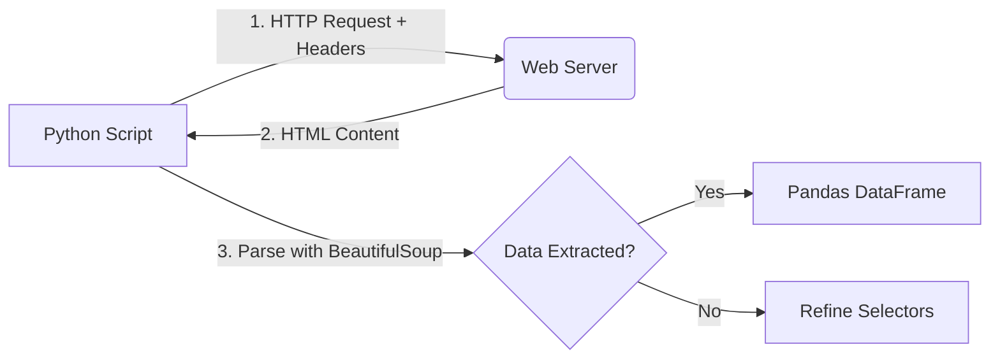

# 🕷️ Day 18: Web Scraping - Creating Your Own Datasets

Welcome to Day 18 of the **100 Days of Machine Learning** series. Today, we tackle a crucial skill for every data professional: **Web Scraping**. When there is no API available to fetch data, we use scraping to extract information directly from the HTML of a website.

---

## 1. What is Web Scraping?

Web Scraping is the automated process of extracting data from websites. While APIs (Day 17) provide data in a neat, structured format (JSON), web scraping involves parsing the "messy" HTML code that builds a webpage.

### Why Scraping?

* **No API:** Many websites do not provide an official API.
* **Custom Data:** You can choose exactly which fields you want to collect.
* **Automation:** Convert thousands of web pages into a single CSV file.

### The Scraping Workflow



---

## 2. Essential Tools & Libraries

1. **Requests:** To send HTTP requests and fetch the HTML content.
2. **BeautifulSoup (BS4):** To navigate and search the HTML tree.
3. **LXML:** A high-performance HTML/XML parser used by BeautifulSoup.
4. **Pandas:** To structure the extracted data into rows and columns.

---

## 3. Dealing with Access Denied (403 Error)

Many websites block automated scripts (bots) to prevent server overload. If you try to fetch a page and get a `<Response [403]>`, the server has rejected you.

**The Solution: User-Agent Headers.**
We send a "Header" that tells the server we are a real browser (like Chrome or Firefox) rather than a script.

```python
headers = {
    'User-Agent': 'Mozilla/5.0 (Windows NT 6.3; Win 64 ; x64) Apple WeKit /537.36 (KHTML , like Gecko) Chrome/80.0.3987.162 Safari/537.36'
}
webpage = requests.get('https://example.com', headers=headers).text
```

---

## 4. Extraction Logic

Once we have the HTML (`webpage`), we convert it into a "Soup" object to make it searchable.

### Basic BeautifulSoup Methods:

* `find()`: Returns the **first** occurrence of a tag.
* `find_all()`: Returns a **list** of all occurrences of a tag.
* `.text`: Extracts the text inside a tag.
* `.strip()`: Removes unnecessary whitespace/newlines.

### The Target: AmbitionBox Company List

In the video, we targeted the following fields for each company:

1. **Name** (h2 tag)
2. **Rating** (p tag with class `rating`)
3. **Reviews** (a tag with class `review-count`)
4. **Company Type** (Public/Private)
5. **Headquarters**
6. **Age** (Company age)
7. **Employees** (Staff count)

---

## 5. Handling Missing Data (Try-Except)

Web pages are often inconsistent. One company might list its employee count, while another doesn't. Without error handling, your script will crash when it tries to access an index that doesn't exist.

```python
try:
    employee_count = i.find_all('p', class_='infoEntity')[3].text.strip()
except:
    employee_count = "NaN" # Handle missing values
```

---

## 6. Full Implementation Logic (Pagination)

To scrape 300+ pages of data, we use a nested loop:

1. **Outer Loop:** Changes the URL page number (e.g., `page=1`, `page=2`).
2. **Inner Loop:** Iterates through every company "container" (usually a `div`) on that specific page.

```python
final_df = pd.DataFrame()

for j in range(1, 11): # Scraping first 10 pages
    url = 'https://www.ambitionbox.com/list-of-companies?page={}'.format(j)
    # ... Fetch and Parse HTML ...
    # ... Extract lists for names, ratings, etc. ...
    # ... Create temp DataFrame ...
    final_df = final_df.append(temp_df, ignore_index=True)
```

---

## 🌍 Real-World Application

* **Lead Generation:** Scraping LinkedIn or Yellow Pages for business contacts.
* **Price Intelligence:** Scraping Amazon/Flipkart to track competitor pricing.
* **News Aggregation:** Collecting headlines from multiple news outlets for sentiment analysis.
* **Real Estate:** Collecting property prices from sites like Zillow or MagicBricks.

---

## 📝 Quick Revision

* **HTML Structure:** Right-click on a webpage and select **Inspect** to find the classes and tags you need.
* **BS4 Parser:** Always use `BeautifulSoup(html_content, 'lxml')` for speed.
* **Class Filtering:** Use `class_` (with an underscore) in BeautifulSoup search to avoid conflict with Python's `class` keyword.
* **Efficiency:** Always use **Try-Except** blocks; web data is rarely perfect.
* **Ethics:** Always check a website's `robots.txt` file (e.g., `website.com/robots.txt`) to see if they allow scraping.

---

**Next Steps:** Try scraping a simple website like "Books to Scrape" or "Quotes to Scrape" to practice your tag selection skills!
