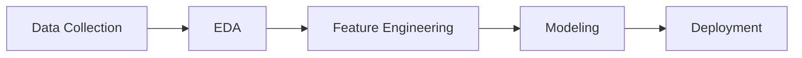
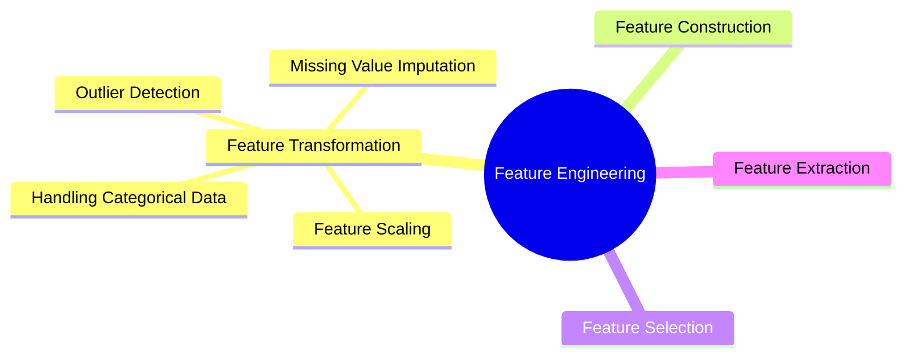

# Day 23: Introduction to Feature Engineering

In the previous sessions, we focused on **Data Gathering** and **Exploratory Data Analysis (EDA)**. By now, you should be comfortable "interrogating" your data. However, raw data is rarely ready for a Machine Learning algorithm. Today, we start a critical 10-15 day journey into **Feature Engineering**.

---

## 🎨 The Art of Feature Engineering

**Feature Engineering** is the process of using domain knowledge to extract or transform features (columns) from raw data to improve the performance of machine learning algorithms.

> **Key Insight:** A "weak" algorithm with high-quality features will almost always outperform a "powerful" algorithm with poor-quality features. It is considered an **art** because there is no single "correct" way to do it—it depends on intuition, experience, and the specific problem.

### Where it fits in the ML Lifecycle

---

## 🛠️ The Four Pillars of Feature Engineering

Feature Engineering can be broadly classified into four major sub-tasks:

---

### 1. Feature Transformation

This is the process of modifying existing features to make them more "palatable" for algorithms.

* **Missing Value Imputation:** Most libraries (like Scikit-Learn) cannot handle `NaN` values. We must decide whether to drop rows or fill them using mean, median, mode, or more advanced techniques.
* **Handling Categorical Features:** Algorithms speak math, not English. We must convert strings (e.g., "Male", "Female") into numbers using techniques like **One-Hot Encoding** or **Label Encoding**.
* **Outlier Detection:** Points that are significantly different from the rest of the data (e.g., a salary of \$1M in a dataset of entry-level workers) can skew models like Linear Regression. We must detect and handle them.
* **Feature Scaling:** If one feature is 1–10 (Age) and another is 10,000–100,000 (Salary), the model might think Salary is more important simply because the numbers are larger. We scale them (e.g., between -1 and 1) to ensure a level playing field.

### 2. Feature Construction

Manually creating **new features** from existing ones based on logic or domain knowledge.

* **Example (Titanic Dataset):** You have two columns: `SibSp` (Siblings/Spouse) and `Parch` (Parents/Children).
* **Engineering:** You can sum them to create a new feature called `Family_Size`. You could then create another feature called `Is_Alone` (1 if family size is 0, else 0). This often provides a much clearer signal to the model.

### 3. Feature Selection

Selecting only the most relevant features to keep the model fast and simple.

* **Example (MNIST Dataset):** This dataset contains 784 pixels (features) for a single handwritten digit.
* **Logic:** Many pixels around the edges of the image are always white/zero across all images. They provide zero information.
* **Action:** We select only the central pixels that actually contain the "ink" of the digit, effectively reducing the number of features.

### 4. Feature Extraction

Algorithmic transformation of data to create a completely new, reduced set of features. Unlike construction, this is highly mathematical.

* **Core Concept:** We take a high-dimensional dataset and compress it into a lower-dimensional space while retaining the most important information.
* **Common Algorithms:**
  * **PCA (Principal Component Analysis)**
  * **LDA (Linear Discriminant Analysis)**
  * **t-SNE**
* **Use Case:** Reducing 1,000 features down to 50 without losing the "essence" of the data.

---

## 💡 Real-World Applications

1. **Healthcare:** Creating a "BMI" feature from "Height" and "Weight" columns (**Feature Construction**).
2. **E-commerce:** Converting "Product Category" names into binary columns to help a recommendation engine (**Feature Transformation**).
3. **Finance:** Dropping a user's "Favorite Color" when predicting credit card fraud (**Feature Selection**).

---

## 🔄 Quick Revision Section

| Technique                | Goal                      | Key Method                           |
| :----------------------- | :------------------------ | :----------------------------------- |
| **Transformation** | Make data algorithm-ready | Scaling, Imputation, Encoding        |
| **Construction**   | Add new signals manually  | Combining or splitting columns       |
| **Selection**      | Remove noise/redundancy   | Statistical tests, edge-case removal |
| **Extraction**     | Dimensionality reduction  | PCA, LDA                             |
