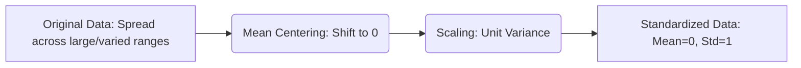

# Feature Scaling - Standardization

Feature Scaling is a critical sub-step within **Feature Engineering**. It is often the final step performed before feeding data into a Machine Learning model.

---

## ⚖️ What is Feature Scaling?

Feature Scaling is a technique used to standardize the independent variables (features) of a dataset into a fixed range.

**The Problem:** In raw data, different features have different ranges.

* **Age:** 0 to 100
* **Salary:** 15,000 to 1,000,000

If an algorithm uses **Euclidean Distance** (like KNN or K-Means), the Salary feature will dominate the Age feature because the numerical differences in Salary are much larger. Scaling ensures that every feature contributes proportionately to the final result.

---

## 🏗️ Standardization (Z-Score Normalization)

Standardization transforms the data such that it has a **Mean of 0** and a **Standard Deviation of 1**.

### 1. Mathematical Formula

For every value $x_i$ in a feature:

$$
x'_i = \frac{x_i - \bar{x}}{\sigma}
$$

Where:

* $\bar{x}$: Mean of the feature.
* $\sigma$: Standard Deviation of the feature.

### 2. Geometric Intuition

Standardization performs two main actions:

1. **Mean Centering:** It shifts the entire distribution so that the mean is at the origin ($0$).
2. **Scaling:** It "squishes" or "expands" the data so that the spread (standard deviation) is exactly $1$.



> **Important:** Standardization does **not** change the shape of the distribution. If your data is bell-shaped (Normal), it remains bell-shaped after standardization.

---

## 🛠️ Implementation with Scikit-Learn

When implementing scaling, you must follow the **Fit-Transform** rule to avoid **Data Leakage**.

1. **Split** data into Train and Test.
2. **Fit** the scaler ONLY on the Training set (calculate $\bar{x}$ and $\sigma$).
3. **Transform** both the Training and Test sets using those calculated values.

```python
from sklearn.preprocessing import StandardScaler
from sklearn.model_selection import train_test_split

# 1. Split
X_train, X_test, y_train, y_test = train_test_split(X, y, test_size=0.3)

# 2. Fit and Transform
scaler = StandardScaler()
scaler.fit(X_train) # Learning Mean and Sigma

X_train_scaled = scaler.transform(X_train)
X_test_scaled = scaler.transform(X_test)
```

---

## 📉 Why is Scaling Important?

### 1. Algorithm Performance

Some models are highly sensitive to the scale of data.

* **Logistic Regression:** Accuracy can jump significantly (e.g., from 65% to 86%) after scaling.
* **Gradient Descent:** If features are on different scales, the "steps" taken towards the minimum will be uneven, making convergence very slow or impossible. Scaling makes the cost function look more "circular," allowing Gradient Descent to go straight to the center.

### 2. Impact of Outliers

Standardization **does not handle outliers** automatically. Since the mean and standard deviation are sensitive to outliers, the resulting scaled values will still be influenced by them. If your data has extreme outliers, you may need to clip them before scaling.

---

## 🚦 When to use Standardization?

| Algorithm Category                 | Needs Scaling? | Examples                                    |
| :--------------------------------- | :------------- | :------------------------------------------ |
| **Distance-Based**           | **YES**  | KNN, K-Means, SVM                           |
| **Gradient Descent-Based**   | **YES**  | Linear/Logistic Regression, Neural Networks |
| **Tree-Based**               | **NO**   | Decision Trees, Random Forest, XGBoost      |
| **Dimensionality Reduction** | **YES**  | PCA (Principal Component Analysis)          |

---

## 🔄 Quick Revision Section

* **Goal:** To bring all features to a similar scale.
* **Formula:** $(x - \text{mean}) / \text{std\_dev}$.
* **Outcome:** Resulting distribution has Mean = 0, Std Dev = 1.
* **Key Pro-Tip:** Never `fit` on the test data. Only `fit` on train and `transform` on both.
* **Algorithms:** Crucial for Linear models, SVMs, KNN, and Neural Networks. Irrelevant for Tree-based models.
