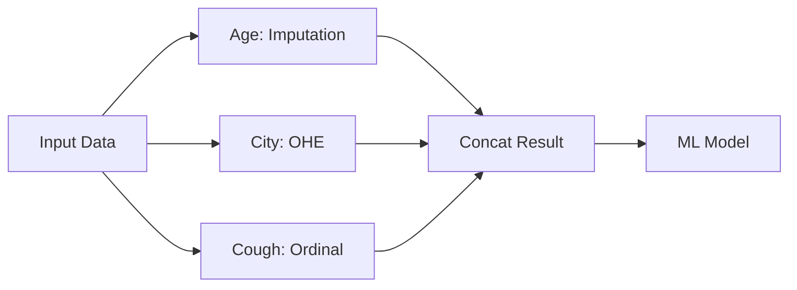

# Scikit-Learn ColumnTransformer: Streamlining Feature Engineering

## 1. Introduction

In real-world Machine Learning projects, datasets are rarely uniform. A single dataset typically contains a mix of numerical, nominal categorical, and ordinal categorical data, often with missing values.

The **ColumnTransformer** is a powerful class in Scikit-Learn (`sklearn.compose`) that allows you to apply specific data transformations to specific columns in a single step.

---

## 2. The Problem: "Aam Zindagi" (The Manual Approach)

Before `ColumnTransformer`, if you had a dataset with different feature types, you had to:

1. **Split** the dataframe into parts based on the required transformation.
2. **Transform** each part independently (e.g., Impute missing ages, One-Hot Encode city names).
3. **Concatenate** the resulting NumPy arrays back together manually.

### The Flow of Manual Preprocessing:



**Why this is bad:**

* **Tedious:** Requires writing a lot of boilerplate code.
* **Error-Prone:** If column order shifts, your concatenation might fail or produce silent bugs.
* **Non-Scalable:** Hard to manage when you have 50+ columns.

---

## 3. The Solution: "Mentos Zindagi" (ColumnTransformer)

Instead of manual slicing and dicing, `ColumnTransformer` acts as a central hub. You define which transformation goes to which column, and it handles the execution and joining automatically.

### Key Features:

* **Automation:** Automatically concatenates results into a single NumPy array.
* **Safety:** Maintains the integrity of the data flow.
* **Pipeline-Ready:** It is designed to work seamlessly within Scikit-Learn Pipelines.

---

## 4. Technical Implementation

### Basic Syntax

```python
from sklearn.compose import ColumnTransformer
from sklearn.impute import SimpleImputer
from sklearn.preprocessing import OneHotEncoder, OrdinalEncoder

transformer = ColumnTransformer(transformers=[
    ('tnf1', SimpleImputer(), ['fever']), # Impute missing values
    ('tnf2', OrdinalEncoder(categories=[['Mild', 'Strong']]), ['cough']), # Ordinal Encoding
    ('tnf3', OneHotEncoder(sparse=False, drop='first'), ['gender', 'city']) # OHE
], remainder='passthrough')

# Apply to training data
X_train_transformed = transformer.fit_transform(X_train)
```

### Components of a Transformer Tuple:

1. **Name:** A string identifier (e.g., `'tnf1'`).
2. **Transformer Object:** The class instance (e.g., `OneHotEncoder()`).
3. **Columns:** A list of column names or indices to which the transformer should be applied.

### The `remainder` Parameter:

* `remainder='drop'`: (Default) Drops any columns not explicitly mentioned in the `transformers` list.
* `remainder='passthrough'`: Keeps the columns that weren't transformed as they are.

---

## 5. Case Study: Covid Patients Dataset

Imagine a dataset with the following columns: `age`, `gender`, `fever`, `cough`, `city`.

| Column           | Data Type    | Problem                    | Solution           |
| :--------------- | :----------- | :------------------------- | :----------------- |
| **Age**    | Numerical    | Needs to stay the same     | `passthrough`    |
| **Fever**  | Numerical    | Has missing values         | `SimpleImputer`  |
| **Cough**  | Ordinal Cat. | Has a rank (Mild < Strong) | `OrdinalEncoder` |
| **Gender** | Nominal Cat. | Binary category            | `OneHotEncoder`  |
| **City**   | Nominal Cat. | Multi-category             | `OneHotEncoder`  |

### Manual vs. ColumnTransformer Code Comparison:

* **Manual:** Requires ~20 lines of code including `np.concatenate` and manual slicing.
* **ColumnTransformer:** Defined in one block and executed in one line (`fit_transform`).

---

## 6. Pro-Tips for Advanced Users

1. **Indices vs. Names:** If you are using NumPy arrays instead of Pandas DataFrames, you can pass column indices (e.g., `[0, 3]`) instead of names.
2. **Sparse Matrices:** By default, if the output contains a lot of zeros (common with OHE), it may return a **Sparse Matrix**. Set `sparse_output=False` in the encoder or `transformer.toarray()` to view it as a standard dense array.
3. **Internal Errors:** Always check your column names. A common error is a `KeyError` due to a mismatch in case (e.g., `Fever` vs `fever`).

---

## 7. Quick Revision

* **What is it?** A class to apply different preprocessing to different columns.
* **Why use it?** Avoids manual concatenation and slicing; makes code cleaner and production-ready.
* **Core Syntax:** `ColumnTransformer(transformers=[(name, obj, cols)], remainder='drop'/'passthrough')`.
* **Output:** Returns a single transformed NumPy array.
* **Best Practice:** Always use this when your features require heterogeneous preprocessing before feeding them into a model.

---

## 8. Real-World Applications

* **Healthcare Data:** Scaling BMI, imputing blood pressure, and one-hot encoding blood group.
* **Financial Data:** Log-transforming transaction amounts while encoding merchant categories and user countries.
* **E-commerce:** Normalizing price while encoding product categories and sentiment scores from reviews.
