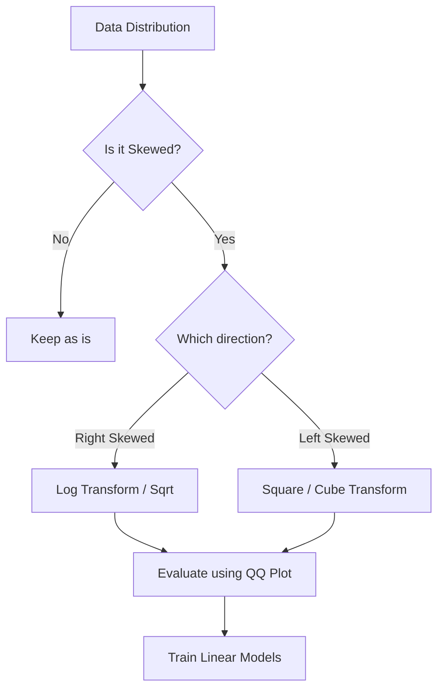

# Mathematical Transformations in Feature Engineering

## 1. Introduction to Mathematical Transformations

Mathematical transformation is a feature engineering technique where we apply a mathematical formula to a column (feature) to change its distribution.

### Why Transform Data?

Most machine learning algorithms, especially **parametric models** like Linear Regression and Logistic Regression, assume that the input variables follow a **Normal (Gaussian) Distribution**. If your data is "skewed" (leaning to one side), these models may perform poorly.

> [!IMPORTANT]
> The primary goal of mathematical transformation is to make the data distribution as close to a **Normal Distribution** as possible.

---

## 2. Normal Distribution and Machine Learning

### The Impact on Algorithms

* **Linear/Logistic Regression:** High impact. They assume normality for better coefficient estimation.
* **Decision Trees/Random Forest:** No impact. These models are non-parametric and handle skewed data naturally.
* **Neural Networks:** Generally benefit from transformations as it helps in faster convergence.

### How to Check for Normality

Before applying transformations, you must verify if your data is normal using these three methods:

1. **Visualization (Distplot):** Using Seaborn's `sns.distplot()` to see the bell curve.
2. **Skewness:** Using `df.skew()`. A value of 0 indicates perfect symmetry.
3. **QQ Plot (Quantile-Quantile Plot):** A scatter plot where points should fall on a 45-degree diagonal line if the data is normal.

---

## 3. Types of Mathematical Transformations

### A. Log Transform

* **Formula:** $y = \log(x)$ or $y = \log(x+1)$
* **Best For:** Right-skewed data.
* **Note:** We use `np.log1p` (which is $\log(1+x)$) to handle cases where the feature contains zero values, as $\log(0)$ is undefined.
* **Application:** Useful for data with exponential growth or large outliers (e.g., Salaries, House Prices).

### B. Reciprocal Transform

* **Formula:** $y = 1/x$
* **Behavior:** It flips the data—large values become small and small values become large.
* **Application:** Used when the inverse relationship is more meaningful.

### C. Power Transforms

* **Square Transform ($x^2$):** Used for Left-skewed data.
* **Square Root Transform ($\sqrt{x}$):** Used for Right-skewed data (milder than Log transform).

---

## 4. Implementation with Scikit-Learn

Scikit-Learn provides a class called `FunctionTransformer` to apply these custom mathematical functions within a pipeline.

### Basic Syntax

```python
from sklearn.preprocessing import FunctionTransformer
import numpy as np

# Apply Log Transform
transformer = FunctionTransformer(func=np.log1p)
X_transformed = transformer.fit_transform(X)
```

### Using ColumnTransformer

To apply different transforms to different columns:

```python
from sklearn.compose import ColumnTransformer

trf = ColumnTransformer([
    ('log', FunctionTransformer(np.log1p), ['Fare']),
    ('square', FunctionTransformer(lambda x: x**2), ['Age'])
], remainder='passthrough')
```

---

## 5. Case Study: The Titanic Dataset

In the video, the Titanic dataset is used to predict survival based on **Age** and **Fare**.

| Feature        | Original Distribution | Best Transform  | Result                                         |
| :------------- | :-------------------- | :-------------- | :--------------------------------------------- |
| **Age**  | Almost Normal         | None (Identity) | Transformation actually made it worse.         |
| **Fare** | Heavily Right-Skewed  | Log Transform   | Distribution became significantly more Normal. |

### Performance Outcome:

* **Logistic Regression:** Accuracy increased from ~64% to ~68% after Log Transformation on the 'Fare' column.
* **Decision Tree:** No change in accuracy (~65%), confirming that tree-based models are invariant to these transformations.

---

## 6. Quick Revision

* **Goal:** Convert skewed data into a Normal Distribution.
* **Algorithms:** Crucial for Linear and Logistic Regression; irrelevant for Tree-based models.
* **Identification:** Use **QQ Plots**. If dots are on the red line, it's normal.
* **Right Skewed?** Use Log or Square Root transform.
* **Left Skewed?** Use Square or Cube transform.
* **Tool:** `sklearn.preprocessing.FunctionTransformer`.
* **Pro Tip:** Always use `np.log1p` instead of `np.log` to avoid errors with zero values.

---

## 7. Concept Map



---

**Next Topics to Explore:**

* Box-Cox Transformation (requires data > 0).
* Yeo-Johnson Transformation (handles negative data).
