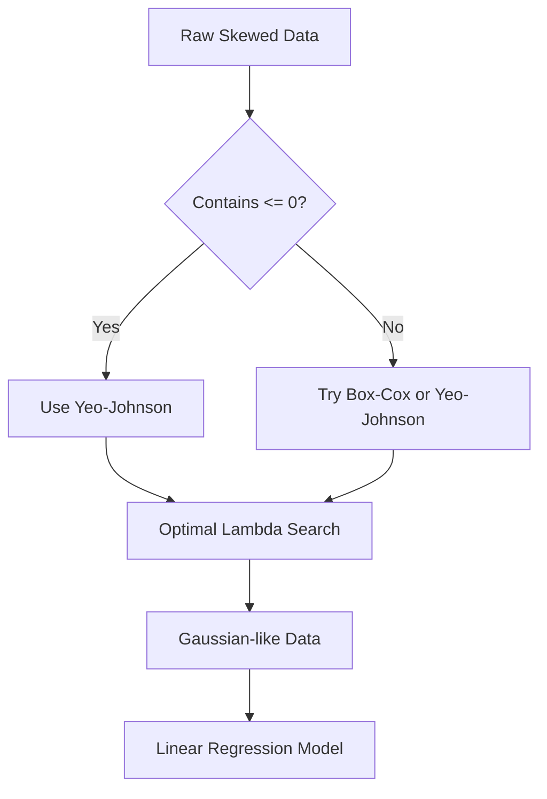

# Mathematical Transformations: Power Transformers

Mathematical transformations are essential feature engineering techniques used to stabilize variance and make data more "Gaussian-like" (Normal Distribution). This is a critical step for parametric models that assume normally distributed input features.

---

## 1. Introduction to Power Transformers

In the previous section, we discussed **Function Transformers** (Log, Square, Square Root). While effective, they are manual. **Power Transformers** are a more automated family of parametric, monotonic transformations.

### Why use Power Transformers?

Many machine learning algorithms (Linear Regression, Logistic Regression, KNN) perform best when the input data follows a normal distribution. In real-world datasets, features are often:

* **Right Skewed** (Long tail on the right)
* **Left Skewed** (Long tail on the left)
* **Heteroscedastic** (Non-constant variance)

Power Transformers find an optimal parameter ($\lambda$) to transform these distributions into a bell curve.

---

## 2. The `PowerTransformer` Class

Scikit-Learn provides the `PowerTransformer` class in the `preprocessing` module. It supports two main methods:

1. **Box-Cox Transform**
2. **Yeo-Johnson Transform**

### How it works internally

The class automatically searches for the best $\lambda$ (exponent) value within a range (typically $-5$ to $5$). It examines various values and selects the one that results in the best approximation to a normal distribution using:

* **Maximum Likelihood Estimation (MLE)** (Default in Scikit-Learn)
* **Bayesian Statistics**

---

## 3. Box-Cox Transformation

Developed by George Box and David Cox, this is the most famous power transformation.

### The Formula

For a given feature $x$ and parameter $\lambda$:

$$
x_i^{(\lambda)} = 
\begin{cases} 
\frac{x_i^\lambda - 1}{\lambda} & \text{if } \lambda \neq 0 \\
\ln(x_i) & \text{if } \lambda = 0 
\end{cases}
$$

> [!IMPORTANT]
> **Strict Constraint:** Box-Cox only works with **strictly positive numbers** ($x > 0$). It cannot handle zero or negative values. If your data contains zeros, you must add a small constant (e.g., $x + 0.00001$) before applying it.

---

## 4. Yeo-Johnson Transformation

The Yeo-Johnson transformation is an extension of Box-Cox designed to overcome its positivity constraint.

### Key Advantages

* **Supports Zero and Negative values:** It can be applied to any real number.
* **Default Choice:** In Scikit-Learn, `method='yeo-johnson'` is the default because it is more versatile.

---

## 5. Practical Implementation

In the case study provided (Concrete Strength Prediction), we see the impact of these transformations on a Linear Regression model.

### Workflow Diagram



### Code Example

```python
from sklearn.preprocessing import PowerTransformer
from sklearn.linear_model import LinearRegression

# 1. Initialize Transformer (Method: 'box-cox' or 'yeo-johnson')
pt = PowerTransformer(method='box-cox')

# 2. Fit and Transform the Training Data
# Note: Box-Cox needs data > 0
X_train_transformed = pt.fit_transform(X_train + 0.000001)
X_test_transformed = pt.transform(X_test + 0.000001)

# 3. View the calculated Lambdas for each column
print(pt.lambdas_)

# 4. Train Model
lr = LinearRegression()
lr.fit(X_train_transformed, y_train)
```

---

## 6. Real-World Impact

In the video example, the **R2 Score** of the Linear Regression model saw a massive jump:

* **Before Transformation:** ~0.46
* **After Box-Cox:** ~0.66
* **After Yeo-Johnson:** ~0.68

### Comparison with Decision Trees

Unlike linear models, **Decision Trees** are non-parametric. In the demo, the Decision Tree performance remained virtually unchanged after transformation (~0.65). This confirms that tree-based models do not rely on feature distribution normality.

---

## 7. Quick Revision

* **Goal:** Convert any distribution into a Normal (Gaussian) distribution.
* **Box-Cox:** Best for strictly positive data.
* **Yeo-Johnson:** Best if data contains zeros or negative numbers.
* **$\lambda$ Parameter:** The exponent found by the algorithm to minimize skewness.
* **Standardization:** Scikit-Learn’s `PowerTransformer` applies **Standard Scaling** (mean=0, variance=1) by default after the transformation.
* **When to use:** Use for Linear Regression, Logistic Regression, and KNN. Do not waste computation on Decision Trees or Random Forests.

---

**Next Step:** Explore **Quantile Transformers** for data with complex, multi-modal distributions.
