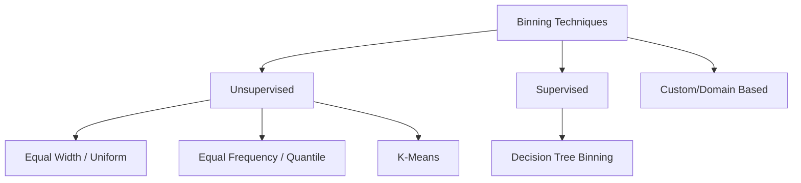

# Encoding Numerical Features: Discretization & Binarization

In feature engineering, we often encounter numerical data that provides better value to a machine learning model if it is converted into categorical groups. This process is known as **Encoding Numerical Features**.

---

## 1. Introduction

While numerical data is generally ideal for algorithms, there are specific scenarios where converting it into categories (bins) improves model performance.

**Real-World Example:**
On the Google Play Store, an app with 23 downloads is very different from one with 10 million. By creating categories like "Niche," "Popular," and "Viral," we simplify the relationship for the model and handle the massive variance in scale.

---

## 2. Discretization (Binning)

Discretization is the process of transforming continuous variables into discrete ones by creating a set of contiguous intervals (bins).

### Why use Discretization?

1. **To handle Outliers:** By placing extreme values into the last bin, they are treated the same as other values in that bin, reducing their influence.
2. **To improve Value Spread:** It can help spread out data that is tightly clustered in one area.

### Types of Binning



#### A. Equal Width (Uniform) Binning

The range of the variable is divided into $N$ intervals of equal size.

* **Formula:** $Width = \frac{Max - Min}{Bins}$
* **Best for:** Uniformly distributed data. It does not handle outliers well as they can stretch the range, leaving most bins empty.

#### B. Equal Frequency (Quantile) Binning

Each bin contains approximately the same number of observations (e.g., 10% of data per bin).

* **Default:** This is the default strategy in Scikit-Learn because it handles skewed data effectively.
* **Benefit:** Improves value spread by making the distribution uniform across categories.

#### C. K-Means Binning

Uses the K-Means clustering algorithm to group values. Each observation is assigned to the bin with the nearest centroid.

* **Application:** Useful when data is naturally clustered into specific groups with gaps in between.

---

## 3. Implementation with Scikit-Learn

We use the `KBinsDiscretizer` class for these operations.

### Key Parameters:

* `n_bins`: Number of intervals.
* `strategy`: 'uniform', 'quantile', or 'kmeans'.
* `encode`:
  * `ordinal`: Returns bin numbers (0, 1, 2...).
  * `onehot`: Returns a sparse matrix (dummy variables).

### Code Example:

```python
from sklearn.preprocessing import KBinsDiscretizer

# Initialize the discretizer
kbins = KBinsDiscretizer(n_bins=10, encode='ordinal', strategy='quantile')

# Fit and transform the data
X_train_bin = kbins.fit_transform(X_train[['Age', 'Fare']])
```

---

## 4. Binarization

Binarization is a special case of discretization where numerical values are converted into binary values (0 or 1) based on a specific **threshold**.

### Use Cases:

* **Analytical Conditions:** Converting "Family Count" into a "Traveling Alone" feature (0 if family = 0, 1 if family > 0).
* **Image Processing:** Converting grayscale pixels (0-255) into black (0) and white (1) using a threshold of 127.5.

### Code Example:

```python
from sklearn.preprocessing import Binarizer

# Values below or equal to threshold become 0; above become 1
binarizer = Binarizer(threshold=0.0) # Useful to check if a value exists
X_family_bin = binarizer.transform(X_family)
```

---

## 5. Custom / Domain Based Binning

In many industries, bins are determined by logic rather than statistics.

* **Example:** Age groups (Kids: 0-18, Adults: 18-60, Seniors: 60+).
* **Implementation:** Usually handled via Pandas using `pd.cut()` or `pd.qcut()`.

---

## 6. Quick Revision

* **Discretization:** Turning continuous numbers into "bins" or groups.
* **Equal Width:** Bins have the same range size (e.g., 0-10, 10-20).
* **Equal Frequency:** Bins have the same number of data points.
* **K-Means:** Bins are created based on clusters in the data.
* **Binarization:** Converting numbers to 0 or 1 based on a threshold.
* **Why?** To handle outliers, simplify complex numerical relationships, and satisfy model assumptions.

---

**Next Topic:** Handling Missing Numerical Data using Imputation Techniques.
