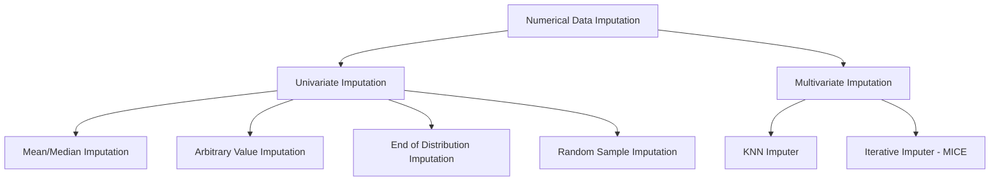

# Handling Missing Numerical Data

Handling missing values is a critical step in the Feature Engineering pipeline. Most machine learning algorithms (like Linear Regression or SVM) cannot handle missing data natively. This guide covers the primary techniques for imputing numerical data, ranging from basic statistics to advanced distribution-based methods.

---

## 1. High-Level Classification

Imputation techniques are broadly classified based on whether they look at a single feature or multiple features simultaneously.



---

## 2. Mean and Median Imputation

This is the most common technique where missing values are replaced by the mean or median of the available values in that column.

### When to use what?

* **Mean Imputation:** Use when the data follows a **Normal (Gaussian) Distribution**.
* **Median Imputation:** Use when the data is **Skewed**. Median is robust to outliers and doesn't get pulled by the "tail" of the distribution.

### Selection Criteria

1. **MCAR:** Data should be **Missing Completely At Random**.
2. **Threshold:** Typically applied when missing data is **less than 5%** of the total observations.

### Pros & Cons

| Advantages                     | Disadvantages                                                                             |
| :----------------------------- | :---------------------------------------------------------------------------------------- |
| Simple to implement            | **Distorts Distribution:** Creates a "spike" at the mean/median.                    |
| Fast for large datasets        | **Reduced Variance:** Imputing the average values makes data more "narrow."         |
| Easy for production deployment | **Affects Relationships:** Changes Covariance and Correlation with other variables. |

---

## 3. Arbitrary Value Imputation

In this method, we replace missing values with a value that is logically "outside" the normal range of the data (e.g., -1, 99, 999).

* **Logic:** It treats "missingness" as a separate category or an important feature itself.
* **Use Case:** Often used when the data is **Not Missing At Random (NMAR)**. It helps the model distinguish between observations that had data and those that didn't.

> [!WARNING]
> This method can heavily distort the variance and distribution, potentially confusing distance-based algorithms like KNN.

---

## 4. End of Distribution Imputation

An extension of arbitrary value imputation, but instead of picking a random number, we pick a value at the far end of the distribution.

### Calculation Methods:

1. **For Normal Distribution:** Use the formula: $Mean + 3 \times \text{Standard Deviation}$
2. **For Skewed Distribution:** Use the **IQR Proximity Rule**:
   * Values > $Q3 + 1.5 \times IQR$

**Why use this?** It pushes missing values into the "outlier" zone, effectively flagging them for the model without requiring a new "Missing Indicator" column.

---

## 5. Implementation in Python

### Using Pandas (Quick & Easy)

```python
# Median Imputation
median_val = df['age'].median()
df['age_median'] = df['age'].fillna(median_val)

# Arbitrary Imputation
df['age_99'] = df['age'].fillna(99)
```

### Using Scikit-Learn (Professional Pipeline)

The `SimpleImputer` class is preferred for production as it can be integrated into `Pipelines` and `ColumnTransformers`.

```python
from sklearn.impute import SimpleImputer
from sklearn.compose import ColumnTransformer

# Define Imputers
imputer_median = SimpleImputer(strategy='median')
imputer_mean = SimpleImputer(strategy='mean')
imputer_arbitrary = SimpleImputer(strategy='constant', fill_value=99)

# Apply to specific columns
trf = ColumnTransformer([
    ('median_impute', imputer_median, ['age']),
    ('mean_impute', imputer_mean, ['fare'])
], remainder='passthrough')
```

---

## 6. Impact Analysis: The "Red Flags"

When you impute data, you must analyze how the data changed. Always check the following after imputation:

1. **Change in Variance:** Imputing mean/median usually leads to a **reduction in variance**.
2. **Change in Covariance/Correlation:** Since you are adding values that aren't inherently related to other columns, the correlation coefficients usually drop.
3. **Boxplot Analysis:** Check for **artificial outliers**. Imputing the median in a skewed dataset can shrink the Interquartile Range (IQR), making existing data points look like outliers.

---

## 7. Quick Revision

* **Univariate** means looking at only one column to fill its gaps.
* Use **Median** if your column has outliers or is skewed.
* Use **Mean** if the data is bell-shaped (Normal).
* **Arbitrary/End of Distribution** methods are useful if the "fact that data is missing" is a signal the model needs to learn.
* **Red Flag:** If the distribution curve changes drastically after filling `NaNs`, your imputation strategy might be too aggressive.
