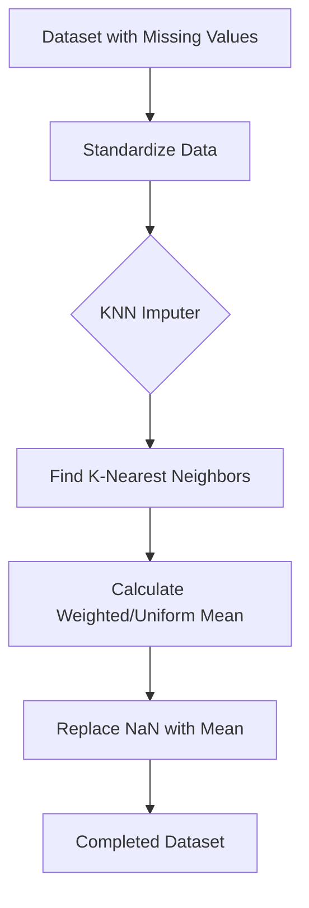

# KNN Imputer: Multivariate Data Imputation

## 1. Introduction

In previous lessons, we focused on **Univariate Imputation** (Mean, Median, Mode, Random Imputation), where we filled missing values using only the information available within that specific column.

**Multivariate Imputation**, specifically the **KNN Imputer**, represents a more sophisticated approach. It assumes that a missing value can be predicted more accurately by looking at other features (columns) and finding similar observations (rows).

### Univariate vs. Multivariate Imputation

| Feature               | Univariate                     | Multivariate (KNN)      |
| :-------------------- | :----------------------------- | :---------------------- |
| **Data Source** | Single column                  | Multiple columns        |
| **Complexity**  | Low                            | High                    |
| **Accuracy**    | Moderate                       | Generally Higher        |
| **Logic**       | Central Tendency (Mean/Median) | Similarity between rows |

---

## 2. Core Concept: "The Neighbor Logic"

The fundamental philosophy of KNN (K-Nearest Neighbors) is: **"You are like your neighbors."**

If a row has a missing value for "Age," the KNN Imputer looks at other rows that are most similar in terms of other features (like Salary, Experience, or City) and uses their "Age" values to fill the gap.

### The 2-Step Process:

1. **Find Neighbors:** Calculate the distance between the row with missing data and all other rows to find the $K$ most similar ones.
2. **Impute:** Calculate the mean (average) of the values from those $K$ neighbors to fill the missing entry.

---

## 3. Mathematical Foundation: NaN-Euclidean Distance

Standard Euclidean distance cannot be calculated if values are missing. To solve this, Scikit-Learn uses the **NaN-Euclidean Distance**.

### The Formula

When comparing two points $x$ and $y$, the distance is adjusted based on the number of coordinates present:

$$
d(x, y) = \sqrt{\frac{\text{Weight}}{\text{# of Coordinates Present}} \times \sum (\text{present coordinates differences})^2}
$$

Where:

* **Weight:** Total number of coordinates (features).
* **# of Coordinates Present:** Number of features where neither $x$ nor $y$ has a missing value.

**Example Logic:**
If you have 4 features but only 2 are available for both rows, the imputer calculates the squared difference for those 2 and scales the result by $4/2$ to account for the missing information.

---

## 4. Implementation Details

The KNN Imputer is available in Scikit-Learn's `impute` module.

### Basic Syntax

```python
from sklearn.impute import KNNImputer

# Initialize the imputer
imputer = KNNImputer(n_neighbors=5, weights='uniform')

# Fit and transform the data
X_imputed = imputer.fit_transform(X)
```

### Critical Hyperparameters

1. **`n_neighbors` (K):**
   * Small $K$ (e.g., 1): Highly sensitive to outliers.
   * Large $K$: May include neighbors that are not actually "similar," leading to biased results.
   * *Default is 5.*
2. **`weights`:**
   * `uniform`: All neighbors contribute equally to the average.
   * `distance`: Closer neighbors have a higher influence on the imputed value than neighbors further away.

---

## 5. Practical Workflow Diagram



> **Note:** It is highly recommended to **Standardize/Scale** your features before using KNN Imputer, as it is a distance-based algorithm. If one feature has a much larger range than others, it will dominate the distance calculation.

---

## 6. Pros and Cons

### Advantages

* **Accuracy:** Much more precise than simple mean/median because it considers feature correlations.
* **No Model Assumptions:** It doesn't assume a linear relationship between variables.

### Disadvantages

* **Computational Expense:** Calculating distances between every pair of rows is very slow for large datasets ($O(n^2)$).
* **Memory Intensive:** Like the KNN classifier, it is a "Lazy Learner." It needs to store the entire training dataset to perform imputation on new test data.
* **Sensitive to Outliers:** Outliers can significantly skew the distance calculation.

---

## 7. Real-World Application

* **Medical Research:** If a patient's "Blood Pressure" reading is missing, KNN can find other patients with similar height, weight, and age to estimate the missing value.
* **Financial Data:** Filling missing "Credit Scores" based on similar income levels, debt ratios, and spending habits.

---

## 8. Quick Revision

* **KNN Imputer** is multivariate; it uses other features to predict missing values.
* It uses **NaN-Euclidean Distance** to handle missingness during the distance calculation.
* **Standardization** is mandatory because KNN is distance-dependent.
* **`n_neighbors`** and **`weights`** are the primary tuning parameters.
* Use KNN Imputer for **small to medium datasets** where accuracy is more critical than processing speed.
