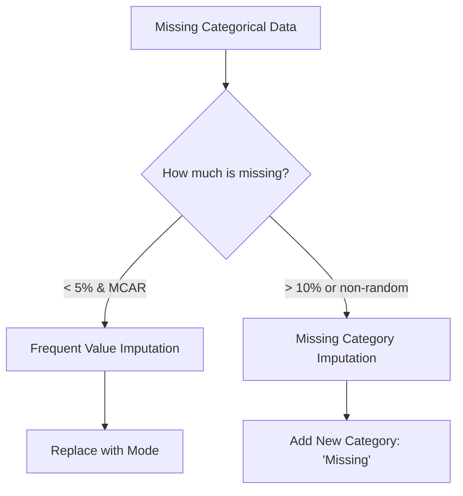

# Handling Categorical Missing Data: A Comprehensive Guide

In machine learning, categorical data represents discrete labels (e.g., City, Color, Gender). Unlike numerical data, you cannot calculate a "mean" or "median" for categorical variables. This guide explores the two most common techniques for imputing missing categorical values.

---

## 📌 Core Imputation Strategies

When dealing with missing categorical data, we primarily use two approaches:

1. **Frequent Value Imputation (Mode Imputation)**
2. **Missing Category Imputation**



---

## 1. Frequent Value Imputation (Mode)

### 🟢 Beginner Explanation

This technique involves finding the most common value (the **Mode**) in a column and using it to fill all the empty spots. If "Mumbai" appears more than any other city in your dataset, you assume the missing values are also likely to be "Mumbai".

### 🛠 Implementation

#### Using Pandas:

```python
# Finding the mode
mode_value = df['City'].mode()[0]

# Filling missing values
df['City'].fillna(mode_value, inplace=True)
```

#### Using Scikit-Learn:

```python
from sklearn.impute import SimpleImputer

imputer = SimpleImputer(strategy='most_frequent')
df_imputed = imputer.fit_transform(df)
```

### ⚠️ Important Considerations

* **Assumptions:** Works best if data is **Missing Completely At Random (MCAR)**.
* **Threshold:** Generally recommended only if **less than 5%** of the data is missing.
* **Impact:** If a large amount of data is missing, this can over-represent the most frequent category, distorting the relationship with the target variable.

---

## 2. Missing Category Imputation

### 🟢 Beginner Explanation

Instead of guessing the value, we treat "Missing" as a piece of information itself. We create a brand new category (label) called **"Missing"** or **"Unknown"** and assign all null values to it.

### 🛠 Implementation

#### Using Pandas:

```python
df['GarageQuality'].fillna('Missing', inplace=True)
```

#### Using Scikit-Learn:

```python
from sklearn.impute import SimpleImputer

imputer = SimpleImputer(strategy='constant', fill_value='Missing')
df_imputed = imputer.fit_transform(df)
```

### 🚀 Advanced Insight: When to use?

* **High Missingness:** When more than 10% of values are missing.
* **Non-Random Patterns:** Sometimes values are missing for a reason. For example, in housing data, "GarageQuality" might be missing because the house simply **does not have a garage**. In this case, labeling it "Missing" (or "No Garage") is more accurate than filling it with the most frequent quality.

---

## 🔍 Evaluating the Impact

To ensure imputation hasn't ruined your data quality, you should compare the distribution of the target variable before and after imputation.

**The KDE Test:**
If you plot the Kernel Density Estimate (KDE) of your target (e.g., `SalePrice`) for a specific category:

1. **Good Imputation:** The curve for the "Imputed" data should closely follow the "Original" data curve.
2. **Bad Imputation:** If the curves diverge significantly, the imputation has introduced bias, and your model might learn incorrect patterns.

---

## 🌍 Real-World Applications

* **E-commerce:** If a customer hasn't specified a "Preferred Delivery Slot," you might use **Frequent Value Imputation** to select the most common slot.
* **Credit Scoring:** If "Employment Type" is missing, using **Missing Category Imputation** (labeling it "Unspecified") might be safer than assuming they have a "Salaried" job.

---

## ⚡ Quick Revision

| Feature               | Frequent Value (Mode)                   | Missing Category Imputation     |
| :-------------------- | :-------------------------------------- | :------------------------------ |
| **Best for...** | Low missingness (<5%)                   | High missingness (>10%)         |
| **Data Type**   | MCAR (Random)                           | Non-random / Structural         |
| **Action**      | Replaces `NaN` with most common label | Replaces `NaN` with "Missing" |
| **Risk**        | Can distort data distribution           | Increases number of categories  |
| **Library**     | `strategy='most_frequent'`            | `strategy='constant'`         |

---

## 🎓 Summary Checklist for Projects

1. [ ] Check percentage of missing values per categorical column.
2. [ ] Identify if values are missing at random (MCAR).
3. [ ] If low missingness, apply Mode Imputation.
4. [ ] If high missingness or logically missing, apply "Missing" label.
5. [ ] Validate using KDE plots to ensure the relationship with the target remains stable.
