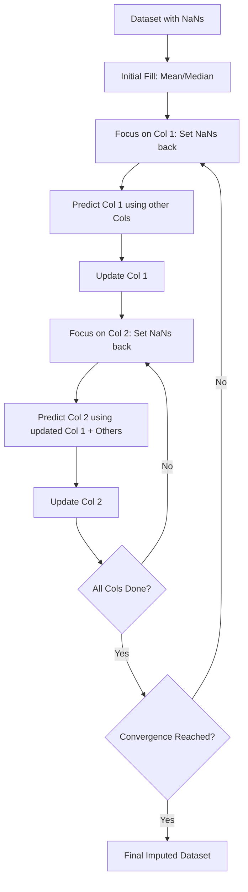

# Multivariate Imputation by Chained Equations (MICE)

## 1. Introduction

In data preprocessing, we often deal with missing values. While **Univariate Imputation** (Mean, Median, Mode) fills missing values using only the information within a single column, **Multivariate Imputation** takes a more sophisticated approach.

**MICE (Multivariate Imputation by Chained Equations)**, also known as **Iterative Imputer** in Scikit-Learn, assumes that a missing value in one column can be predicted using the information available in all other columns of the dataset.

---

## 2. Theory: Missing Data Categories

To understand when to use MICE, we must categorize how data goes missing:

* **MCAR (Missing Completely at Random):** There is no relationship between the missing data and any other values in the dataset.
* **MAR (Missing at Random):** The probability of data being missing is related to some observed data (other columns), but not the missing data itself. **MICE works best under this assumption.**
* **MNAR (Missing Not at Random):** The reason for missingness is related to the unobserved value itself (e.g., people with very high debt refusing to disclose their debt).

---

## 3. How MICE Works (Step-by-Step)

The algorithm operates iteratively. Let's assume a dataset with three features: **Age**, **Salary**, and **Experience**, where all have some missing values.

### Step 0: Initial Imputation

Fill all missing values in all columns using a simple univariate method (usually the **Mean** of the respective column).

### Step 1: The "Chained" Process

We iterate through columns from left to right:

1. **Select Column 1 (Age):** Change its originally missing values back to `NaN`. Keep the current values (means/previous iterations) for Salary and Experience.
2. **Prediction:** Use Salary and Experience as "Input Features" $(X)$ and Age as the "Target Variable" $(y)$.
3. **Model Training:** Train a regression model (e.g., Linear Regression) on the rows where Age was not missing.
4. **Fill NaNs:** Use the trained model to predict the `NaN` values in Age. Update the Age column.

### Step 2: Continue the Chain

Repeat the same process for **Salary**:

1. Change Salary's original missing values back to `NaN`.
2. Use the **updated Age** and the current Experience to predict Salary.
3. Update the Salary column.

*Repeat this for every column in the dataset. This completes **Iteration 1**.*

### Step 3: Iteration until Convergence

The entire dataset is updated again in **Iteration 2**, **Iteration 3**, etc.

**When do we stop?**
We subtract the current imputed values from the previous iteration's values. As the iterations continue, this difference approaches **zero**. Once the values stabilize (converge), the process stops.

---

## 4. The Iteration Workflow



---

## 5. Advantages & Disadvantages

### Advantages

* **High Accuracy:** Captures complex relationships between features.
* **Flexibility:** You can use different algorithms (Linear Regression, Decision Trees, Bayesian Ridge) to predict the missing values.
* **Preserves Distribution:** Unlike mean imputation, MICE maintains the variance and correlations within the data.

### Disadvantages

* **Slow Computation:** Training multiple models for multiple iterations is computationally expensive on large datasets.
* **Memory Usage:** Requires keeping the full training set in memory during prediction/deployment.
* **Inductive Nature:** Like KNN, you must store the "imputer" model to transform new, incoming data.

---

## 6. Real-World Application

* **Medical Studies:** Predicting a patient's missing "Cholesterol" level based on their blood pressure, weight, and age.
* **Financial Surveys:** Estimating missing "Income" levels based on profession, education, and geographic location.

---

## 7. Implementation Note (Scikit-Learn)

In Scikit-Learn, this is implemented as `IterativeImputer`. It is currently an experimental feature, so it must be explicitly enabled.

```python
from sklearn.experimental import enable_iterative_imputer
from sklearn.impute import IterativeImputer
from sklearn.linear_model import BayesianRidge

imputer = IterativeImputer(estimator=BayesianRidge(), max_iter=10, random_state=0)
X_imputed = imputer.fit_transform(X)
```

---

## 8. Quick Revision

1. **MICE** = Multivariate Imputation by Chained Equations.
2. **Assumption:** MAR (Missing at Random).
3. **Core Logic:** It treats each column with missing data as a "Target" and others as "Features" in a prediction problem.
4. **Iteration:** It repeats the process until the values stop changing significantly (**Convergence**).
5. **Complexity:** Higher than `SimpleImputer` but lower than some deep learning methods.
6. **Usage:** Best for datasets where features are significantly correlated.
