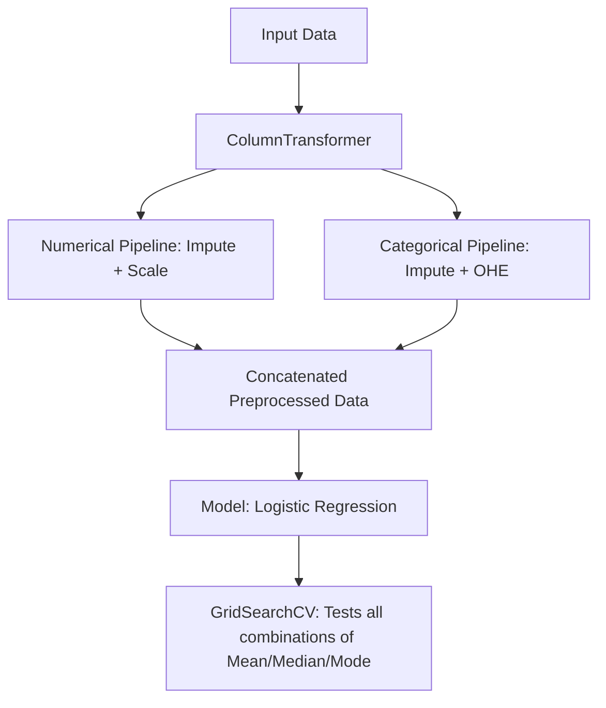

# Handling Missing Data: Random Imputation, Missing Indicators & GridSearch

In this lesson, we explore advanced univariate imputation techniques used to handle missing values in datasets. We move beyond simple mean/median imputation to techniques that preserve data distribution and capture the significance of "missingness" itself.

---

## 1. Random Value Imputation

### Concept (Beginner Level)

Random Value Imputation involves filling missing values in a column by randomly selecting existing observed values from that same column.

Unlike mean or median imputation (which fills every hole with the same number), random imputation picks a different observed value for each missing entry.

**Visual Representation:**

```text
Original Column (Age)        Random Sampling        Imputed Column
---------------------        ---------------        --------------
20                           (Observed)             20
NaN                <--       Samples [20, 35, 40]   35
35                           (Observed)             35
NaN                <--       Samples [20, 35, 40]   20
40                           (Observed)             40
```

### Advanced Insights

* **Preservation of Variance:** Because we sample from the existing data, the variance and the overall distribution (shape of the histogram) remain almost identical before and after imputation.
* **Linear Models:** Highly suitable for linear regression and logistic regression because it doesn't distort the feature's distribution.
* **The Covariance Problem:** While it preserves individual column variance, it can disturb the **covariance** (relationship) between the imputed column and other variables because the randomness is independent of other features.

### Pros and Cons

| Pros                                           | Cons                                                                                                                      |
| :--------------------------------------------- | :------------------------------------------------------------------------------------------------------------------------ |
| Preserves the distribution/shape of data.      | Disturb covariance with other variables.                                                                                  |
| Easy to implement using Pandas.                | **Memory Heavy:** To deploy, you must store the original training set to extract values for future production data. |
| Works for both Numerical and Categorical data. | Induced randomness might not play well with Tree-based models.                                                            |

---

## 2. Missing Indicator

### The Concept

Sometimes, the fact that a value is missing is a signal in itself. For example, in a survey, people with very high or very low incomes might be less likely to report it.

A **Missing Indicator** is a binary feature (True/False or 1/0) that identifies whether a value was originally missing.

### Why use it?

It captures the "pattern of missingness." Even if you impute the original column with the mean, the model retains the knowledge that the specific row was originally empty via the indicator column.

**Example:**

| Age         | Age_NA         |
| :---------- | :------------- |
| 28          | False          |
| 29.8 (Mean) | **True** |
| 35          | False          |

### Implementation in Scikit-Learn

You can use the `MissingIndicator` class or, more simply, set a parameter in `SimpleImputer`:

```python
from sklearn.impute import SimpleImputer
# This automatically adds a binary column for every column that had NaNs
si = SimpleImputer(strategy='mean', add_indicator=True)
```

---

## 3. Automatic Parameter Selection (GridSearchCV)

When building a machine learning pipeline, you often don't know which imputation strategy is best (Mean? Median? Random?). We can use **GridSearchCV** to let the machine decide based on the final model accuracy.

### Pipeline Architecture

To do this effectively, we use a `Pipeline` that combines a `ColumnTransformer` (for preprocessing) and an `Estimator` (like Logistic Regression).

**The Workflow Diagram:**



### Key Implementation Snippet

When tuning parameters in a pipeline, you use the `__` (double underscore) syntax to reach deep into the nested objects:

```python
param_grid = {
    'preprocessor__num__imputer__strategy': ['mean', 'median'],
    'preprocessor__cat__imputer__strategy': ['most_frequent', 'constant'],
    'classifier__C': [0.1, 1.0, 10.0]
}

grid_search = GridSearchCV(full_pipeline, param_grid, cv=10)
grid_search.fit(X_train, y_train)
```

---

## Real-World Applications

1. **Financial Modeling:** Missing Indicators are crucial in credit scoring where "no data" often implies a specific type of risk.
2. **Health Data:** Random imputation is useful in clinical trials where preserving the natural variance of biological markers is more important than pinpoint accuracy for a single individual.
3. **Kaggle Competitions:** Many winning solutions (like those in the KDD Cup) owe their edge to using Missing Indicators to find hidden signals in data gaps.

---

## Quick Revision

* **Random Imputation:** Samples from observed values. Best for keeping the histogram shape (distribution) intact.
* **Deployment Hurdle:** Random imputation requires storing the training data in production, making it "memory heavy."
* **Missing Indicator:** A binary column $(0/1)$ flagging missing values. Essential if the "reason" for missing data is non-random.
* **SimpleImputer Tip:** Always try `add_indicator=True` to see if it improves your model's score.
* **GridSearchCV:** The gold standard for choosing imputation strategies. Don't guess—test!

---

*Notes compiled for GitHub Learning Repo - ML Preprocessing Series.*
