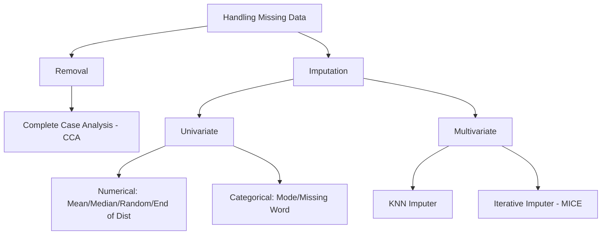

# Handling Missing Data: Complete Case Analysis (CCA)

## Introduction

Machine Learning algorithms (especially those in libraries like Scikit-Learn) are generally not designed to handle missing values (`NaN`, `Null`). If you attempt to train a model with missing data, the algorithm will likely throw an error. As a Data Scientist, it is your responsibility to handle these gaps before the training process.

There are two primary strategies for handling missing data:

1. **Removal:** Discarding the missing values.
2. **Imputation:** Filling in the missing values with estimated ones.

---

## The Landscape of Missing Data Handling

Before diving into Complete Case Analysis, it is important to see where it fits in the broader hierarchy of data cleaning.



---

## 1. What is Complete Case Analysis (CCA)?

**Complete Case Analysis**, also known as **"List-wise deletion,"** consists of discarding observations (rows) where values in *any* of the variables are missing.

In simple terms: if a row has even one missing piece of information, you delete the entire row.

### The Core Assumption: MCAR

CCA is only valid if the data is **Missing Completely At Random (MCAR)**.

* **Definition:** The probability of data being missing is the same for all observations. There is no hidden pattern or relationship between the missingness and any other values in the dataset.
* **Why it matters:** If data is MCAR, dropping rows will reduce the sample size but will **not** bias the results. The remaining data remains a representative sample of the population.

---

## 2. When to Use CCA?

While CCA is easy, it shouldn't be used blindly. Follow these industry "Rules of Thumb":

1. **MCAR Assumption:** You must be reasonably sure the data is missing randomly.
2. **The 5% Rule:** Generally, CCA is preferred only when the missing data in a column is **less than 5%** of the total observations.
3. **Large Datasets:** If you have 1 million rows and 1% is missing, dropping them doesn't hurt. If you have 100 rows and 5% is missing, those 5 rows might be crucial.

> **Pro Tip:** If a column has **95%+ missing data**, instead of dropping rows, you should consider dropping the **entire column**.

---

## 3. Advantages & Disadvantages

| Advantages                                                                                         | Disadvantages                                                                                                      |
| :------------------------------------------------------------------------------------------------- | :----------------------------------------------------------------------------------------------------------------- |
| **Simple to implement:** No complex math required.                                           | **Data Loss:** Can exclude a large fraction of the original dataset.                                         |
| **No Data Manipulation:** You aren't "guessing" values (imputing), which keeps data "pure."  | **Bias Risk:** If data is NOT MCAR, dropping rows will change the distribution and bias the model.           |
| **Preserves Distribution:** If data is MCAR, the distribution of variables remains the same. | **Production Issues:** The model won't know how to handle missing data in real-world use cases (production). |

---

## 4. Practical Workflow (Python)

When performing CCA, you must compare the dataset **before** and **after** dropping values to ensure you haven't distorted the data.

### Step 1: Identify Missing Percentages

```python
# Calculate percentage of missing values per column
df.isnull().mean() * 100
```

### Step 2: Filter Relevant Columns

Identify columns where missingness is > 0 but < 5%.

```python
cols = [var for var in df.columns if df[var].isnull().mean() < 0.05 and df[var].isnull().mean() > 0]
```

### Step 3: Perform the Drop

```python
new_df = df[cols].dropna()
```

### Step 4: Distribution Validation (Crucial)

After dropping, you must check if the "shape" of your data changed.

* **For Numerical Data:** Plot Histograms/PDFs of the column before and after. The curves should almost perfectly overlap.
* **For Categorical Data:** Compare the ratio of categories. If "Graduate" was 70% of the data before, it should still be ~70% after.

---

## 5. Real-World Application

Imagine an HR dataset for job candidates.

* **City Development Index:** 2% missing. (Use CCA)
* **Experience:** 0.3% missing. (Use CCA)
* **Gender:** 25% missing. (**Do NOT use CCA**; you would lose 1/4 of your data. Use Imputation instead.)

---

## Quick Revision Summary

* **CCA** means dropping any row that contains a missing value.
* It is also called **List-wise deletion**.
* **Assumption:** Data must be **MCAR** (Missing Completely At Random).
* **Threshold:** Typically used when missing data is **< 5%**.
* **Validation:** Always compare the Histogram (Numerical) or Category Ratios (Categorical) before and after dropping to ensure the data distribution is preserved.
* **The Big Flaw:** If the model encounters missing data in production, it will crash because CCA didn't teach it how to handle "empty" inputs.
