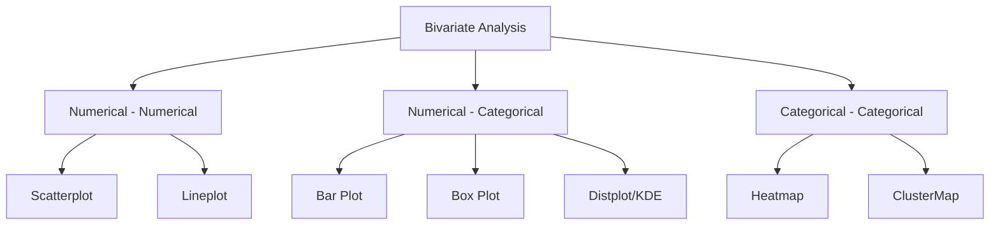

# Day 21: Bivariate and Multivariate Analysis

In the previous session, we explored **Univariate Analysis**, where we looked at each column independently. Today, we move into **Bivariate** (two variables) and **Multivariate** (more than two variables) analysis. This is where we uncover the relationships, correlations, and hidden stories between different features of our data.

---

## 🏗️ Analysis Roadmap

The type of visualization depends entirely on the data types of the columns you are comparing:



---

## 1. Numerical - Numerical Analysis

We use this when both variables are continuous (e.g., Total Bill and Tip).

### A. Scatterplot

The primary tool to see if there is a linear or non-linear relationship between two continuous variables.

**Code:**

```python
import seaborn as sns
sns.scatterplot(tips['total_bill'], tips['tip'])
```

### B. Multivariate Analysis using Scatterplot

We can expand a 2D scatterplot into 4 or 5 dimensions using:

* **`hue`**: Adds a third dimension using color (categorical).
* **`style`**: Adds a fourth dimension using markers (e.g., circles vs. crosses).
* **`size`**: Adds a fifth dimension by varying point size (numerical).

**Example (Tips Dataset):**

```python
sns.scatterplot(tips['total_bill'], tips['tip'], hue=tips['sex'], style=tips['smoker'], size=tips['size'])
```

* **Insight:** You can see how much a male smoker tipped relative to a female non-smoker on one single graph.

---

## 2. Numerical - Categorical Analysis

We use this when comparing a continuous value across different groups (e.g., Age vs. Survival).

### A. Bar Plot (Aggregation)

Shows the **average** value of a numerical column for every category. It also provides a "Confidence Interval" (the black line in the middle).

**Example (Titanic):**

```python
sns.barplot(titanic['Pclass'], titanic['Age'])
```

* **Insight:** Reveals the average age of passengers in each class. Typically, 1st class passengers are older than 3rd class.

### B. Box Plot (Distribution)

Comparing the 5-number summary across categories. It is excellent for spotting which category has the most outliers.

**Code:**

```python
sns.boxplot(titanic['Sex'], titanic['Age'], hue=titanic['Survived'])
```

### C. Distplot / KDE Plot

By overlaying KDE curves of different categories, we can see the "probability" of an event based on age.

**Example Insight:**

* By plotting the age of those who survived vs. those who died, we see that children (Age 0-5) have a higher survival probability (the "Survived" curve is higher than the "Died" curve at the start of the X-axis).

---

## 3. Categorical - Categorical Analysis

We use this to see how categories interact (e.g., Pclass vs. Survived).

### A. Heatmap

To plot a heatmap, we first need a **Contingency Table** (Crosstab).

**Code:**

```python
import pandas as pd
ct = pd.crosstab(titanic['Pclass'], titanic['Survived'])
sns.heatmap(ct)
```

* **Insight:** Bright colors indicate high density. It shows at a glance that 3rd class (Pclass 3) had the highest number of deaths (Survived 0).

### B. ClusterMap

A clustermap takes the heatmap and groups similar categories together using **Hierarchical Clustering** (Dendrograms). It tells us which features behave similarly.

```python
sns.clustermap(pd.crosstab(titanic['Parch'], titanic['Survived']))
```

---

## 4. Global Overview: Pairplot

If your dataset has multiple numerical columns and you want to see every possible scatterplot combination at once, use `pairplot`.

**Code:**

```python
sns.pairplot(iris, hue='species')
```

* **Utility:** The diagonal shows the histogram (univariate), and the rest show scatterplots (bivariate). This is usually the first thing data scientists plot to find correlations quickly.

---

## 5. Time Series: Lineplot

When the X-axis represents **Time** (Year, Month, Day), a lineplot is mandatory to see trends.

**Code:**

```python
sns.lineplot(new_flights['year'], new_flights['passengers'])
```

* **Insight:** Reveals if the airline business is growing linearly or exponentially over time.

---

## 💡 Real-World Applications

1. **Finance:** Scatterplot of "Interest Rates" vs "Stock Prices" to find inverse correlation.
2. **Healthcare:** KDE plots of "Blood Pressure" grouped by "Smoker/Non-Smoker" to see risk distribution.
3. **Retail:** Heatmaps of "Day of Week" vs "Sales" to identify peak shopping hours.

---

## 🔄 Quick Revision Checklist

| Comparison Type                             | Best Plot   |
| :------------------------------------------ | :---------- |
| **Num vs Num (Relationship)**         | Scatterplot |
| **Num vs Num (Trend over Time)**      | Lineplot    |
| **Num vs Cat (Average Comparison)**   | Barplot     |
| **Num vs Cat (Outlier/Distribution)** | Boxplot     |
| **Cat vs Cat (Density/Frequency)**    | Heatmap     |
| **Massive Numerical Data Scan**       | Pairplot    |

---

*Next Session: Automated EDA - Learning how to do all of the above with a single line of code using Pandas Profiling.*
