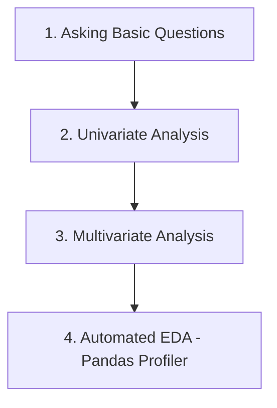

# Day 19: Understanding Your Data (Descriptive Statistics)

In Machine Learning, before building a model, it is crucial to understand the data you are working with. This phase is often referred to as **Exploratory Data Analysis (EDA)**. Over the next few sessions, we will dive deep into various techniques to "interrogate" our data.

---

## 🛠 Roadmap: Understanding Your Data

The process of understanding data is divided into four major parts:



This guide covers **Part 1: Asking Basic Questions** using the famous **Titanic Dataset**.

---

## 7 Essential Questions to Ask Your Dataset

When you first load a dataframe (`df`), follow this 7-step checklist to get a comprehensive overview of your data.

### 1. How big is the data?

Understanding the scale helps you decide if you can process it locally or need distributed computing (like Spark). It also sets expectations for training time.

* **Function:** `df.shape`
* **Why it matters:** Large datasets might require memory optimization or sampling.

```python
df.shape
# Output: (891, 12) -> 891 rows, 12 columns
```

### 2. How does the data look?

A quick preview helps you understand the columns and identify obvious formatting issues.

* **Functions:** `df.head()`, `df.tail()`, or `df.sample(5)`
* **Pro Tip:** Use `df.sample()` instead of `df.head()`. `head()` only shows the top rows, which might be sorted. `sample()` gives a random look at the data, helping you spot biases.

```python
df.sample(5)
```

### 3. What is the data type of columns?

This identifies which columns are numerical, categorical, or objects (strings).

* **Function:** `df.info()`
* **Optimization:** If a column like `Age` is stored as a `float64` but only contains whole numbers, converting it to `int` can significantly reduce memory usage in massive datasets.

```python
df.info()
```

### 4. Are there any missing values?

Missing data can break models or lead to biased results.

* **Function:** `df.isnull().sum()`
* **Actionable Insight:** In the Titanic data, `Cabin` has 687 missing values out of 891. Since ~77% of data is missing, we might consider dropping this column or creating a "No Cabin" category.

```python
df.isnull().sum()
```

### 5. How does the data look mathematically?

Get a statistical summary of all numerical columns.

* **Function:** `df.describe()`
* **Metrics Included:** Mean, standard deviation, min/max, and percentiles (25%, 50%, 75%).
* **Detecting Anomalies:** If the max age is 200 or the min price is -50, you know you have outliers or data entry errors.

```python
df.describe()
```

### 6. Are there duplicate values?

Duplicate rows provide no new information and can lead to overfitting by giving too much weight to specific instances.

* **Function:** `df.duplicated().sum()`
* **Action:** If the sum is $>0$, use `df.drop_duplicates()`.

```python
df.duplicated().sum()
```

### 7. How is the correlation between columns?

Correlation measures the linear relationship between features.

* **Function:** `df.corr()`
* **Scale:** -1 to +1.
  * **+1:** Perfect positive correlation (as X increases, Y increases).
  * **-1:** Perfect negative correlation (as X increases, Y decreases).
  * **0:** No linear relationship.
* **Feature Selection:** If an input column has 0 correlation with the output (target), it might be useless for the model (e.g., `PassengerId`).

```python
# Check correlation of all features with the target 'Survived'
df.corr()['Survived']
```

---

## 💡 Real-World Application: Titanic Dataset

By asking these questions on the Titanic data, we discovered:

1. **Fare & Survival:** Positive correlation (Higher fare = higher chance of survival).
2. **Pclass & Survival:** Negative correlation (Class 3 had the lowest survival rate).
3. **Age:** Stored as float (can be optimized to int).
4. **Cabin:** Too many missing values (needs handling).

---

## 🔄 Quick Revision Checklist

| Task                    | Pandas Function           |
| :---------------------- | :------------------------ |
| **Size**          | `df.shape`              |
| **Preview**       | `df.sample(n)`          |
| **Dtypes/Memory** | `df.info()`             |
| **Missing Data**  | `df.isnull().sum()`     |
| **Statistics**    | `df.describe()`         |
| **Duplicates**    | `df.duplicated().sum()` |
| **Relationships** | `df.corr()`             |
