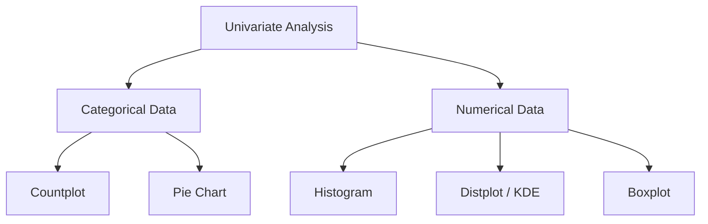

# Exploratory Data Analysis (EDA) - Univariate Analysis

In the previous session, we learned how to ask basic questions of our dataset. Today, we begin the actual process of **Exploratory Data Analysis (EDA)**. The primary goal of EDA is to understand the data's internal structure, detect outliers, and identify patterns.

---

## 🏗️ What is Univariate Analysis?

Analysis is categorized based on the number of variables involved:

1. **Univariate Analysis:** Analyzing a single variable (one column) independently.
2. **Bivariate Analysis:** Analyzing the relationship between two variables.
3. **Multivariate Analysis:** Analyzing the relationship between more than two variables.

This note focuses on **Univariate Analysis**. We interrogate each column to understand its distribution and nature.



---

## 1. Analyzing Categorical Data

Categorical data represents discrete groups (e.g., Gender, Survived [0/1], Embarked [S, C, Q]).

### A. Countplot

A countplot is essentially a bar chart that shows the frequency of each category.

**Code Snippet:**

```python
import seaborn as sns
sns.countplot(df['Survived'])
# Shows how many people died (0) vs survived (1)
```

### B. Pie Chart

If you want to understand the **percentage distribution** of categories, a pie chart is more effective.

**Code Snippet:**

```python
df['Pclass'].value_counts().plot(kind='pie', autopct='%.2f')
```

* **Real-world Insight:** In the Titanic dataset, a pie chart reveals that ~55% of passengers were in the 3rd class (the cheapest class), which correlates with higher casualty rates.

---

## 2. Analyzing Numerical Data

Numerical data represents continuous values (e.g., Age, Fare).

### A. Histogram

A histogram groups numerical data into "bins" (ranges) to show the frequency of values within those ranges.

**Code Snippet:**

```python
import matplotlib.pyplot as plt
plt.hist(df['Age'], bins=10)
```

* **Understanding Bins:** By adjusting bins, you can see finer details of the distribution (e.g., infants vs. elderly).

### B. Distplot (KDE)

The `distplot` combines a histogram with a **KDE (Kernel Density Estimation)**.

* **KDE:** A smooth curve that represents the **Probability Density Function (PDF)**.
* **Utility:** It tells you the probability of finding a value at a specific point on the X-axis.

**Code Snippet:**

```python
sns.distplot(df['Age'])
```

### C. Boxplot

The boxplot is used to visualize the **5-number summary** and identify **outliers**.

#### Anatomy of a Boxplot:

1. **Minimum:** Calculated as $Q1 - 1.5 \times IQR$
2. **Q1 (25th Percentile):** 25% of data is below this value.
3. **Median (50th Percentile):** The middle value of the data.
4. **Q3 (75th Percentile):** 75% of data is below this value.
5. **Maximum:** Calculated as $Q3 + 1.5 \times IQR$
6. **Outliers:** Data points appearing as individual dots outside the "whiskers."

**Code Snippet:**

```python
sns.boxplot(df['Fare'])
```

---

## 📈 Advanced Concept: Skewness

When looking at a distribution (via `distplot`), we check for **Skewness**:

* **Normal Distribution:** Symmetrical (Bell Curve).
* **Positive Skew:** Tail is longer on the right side (most data is concentrated on the left).
* **Negative Skew:** Tail is longer on the left side (most data is concentrated on the right).

**How to calculate in Pandas:**

```python
df['Age'].skew()
```

* **Interpretation:** A value of `0` means perfect symmetry. Positive values indicate a right skew, and negative values indicate a left skew.

---

## 💡 Real-World Applications

1. **Outlier Detection:** Using boxplots on a "Salary" column to find data entry errors (e.g., someone accidentally adding an extra zero).
2. **Demographic Understanding:** Using countplots on "Customer Segments" to see which group visits a store most frequently.
3. **Risk Assessment:** Using histograms on "Transaction Amounts" to define what constitutes a "normal" vs. "suspicious" spend range.

---

## 🔄 Quick Revision Table

| Plot Type                | Data Type   | Key Usage                        |
| :----------------------- | :---------- | :------------------------------- |
| **Countplot**      | Categorical | Frequency of categories          |
| **Pie Chart**      | Categorical | Percentage distribution          |
| **Histogram**      | Numerical   | Frequency distribution in ranges |
| **Distplot (KDE)** | Numerical   | Probability density/Skewness     |
| **Boxplot**        | Numerical   | Outliers & 5-number summary      |
