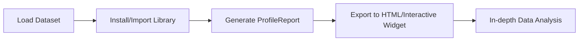

# Day 22: Automated EDA with Pandas Profiling

In the previous sessions, we manually performed Exploratory Data Analysis (EDA) by asking basic questions, performing Univariate analysis, and diving into Bivariate/Multivariate relationships. While these manual steps are essential for building intuition, they can be time-consuming.

Today, we explore **Pandas Profiling**, a powerful tool that automates almost the entire EDA process with just a few lines of code.

---

## 🏗️ What is Pandas Profiling?

**Pandas Profiling** (now officially renamed to `ydata-profiling`) is an open-source Python library that generates an interactive HTML report for a given DataFrame. It provides a comprehensive overview of the data, including statistics, correlations, missing values, and distributions.

### Workflow Diagram



---

## 🛠️ Setup and Installation

Before using the library, you need to install it via pip.

```bash
# In terminal or Jupyter cell
!pip install pandas-profiling
```

*Note: If you are using a more recent environment, you might need to use `pip install ydata-profiling`.*

---

## 🚀 Implementation Code

Generating a full-scale report on a dataset (like the Titanic dataset) requires very little code:

```python
import pandas as pd
from pandas_profiling import ProfileReport

# 1. Load the data
df = pd.read_csv('train.csv')

# 2. Create the Profile Report object
prof = ProfileReport(df)

# 3. Export the report to an HTML file
prof.to_file(output_file='data_analysis_report.html')
```

---

## 📊 Breakdown of the Profiling Report

The generated HTML report is divided into five primary sections, each covering a different aspect of EDA:

### 1. Overview

Provides high-level **Dataset Statistics**:

* Number of variables (columns) and observations (rows).
* Total missing cells and percentage of missing data.
* **Duplicate rows**: Automatically detects and highlights redundancy.
* **Variable types**: Categorizes data into Numeric, Categorical, Boolean, etc.

### 2. Variables (Univariate Analysis)

For every column, the tool provides:

* **Descriptive Stats**: Mean, Minimum, Maximum, Standard Deviation.
* **Quantile Stats**: Q1, Median, Q3, IQR.
* **Distribution Visualization**: A detailed histogram.
* **Advanced Metrics**: Skewness, Kurtosis, and Monotonicity.
* **Warnings**: Highlights high cardinality (too many unique strings) or high percentage of zeros.

### 3. Interactions (Bivariate Analysis)

This section allows you to select any two numerical variables to generate an automatic **Scatter Plot**. This helps in identifying linear or non-linear relationships between features instantly.

### 4. Correlations

The tool generates a heat map for multiple correlation coefficients:

* **Pearson’s r**: Linear relationship.
* **Spearman’s ρ**: Rank correlation.
* **Kendall’s τ**: Similar to Spearman but better for smaller datasets.
* **Phik (φk)**: Excellent for finding correlations between categorical and numerical variables simultaneously.

### 5. Missing Values

It provides three types of visualizations to understand data gaps:

* **Count/Matrix**: Simple bar charts of non-null values.
* **Heatmap**: Shows if the presence/absence of one variable is correlated with another.
* **Dendrogram**: Groups variables that have similar missing patterns using hierarchical clustering.

---

## 💡 Real-World Applications

* **Initial Data Assessment**: When you receive a new, unknown dataset from a client, run Profiling first to see if the data is "clean" enough to work with.
* **Feature Selection**: High correlation heatmaps help you identify "Multicollinearity," allowing you to drop redundant features before training.
* **Data Cleaning**: The "Warnings" section tells you exactly which columns have too many missing values or outliers to be useful.

---

## 🔄 Quick Revision Section

| Task                     | Manual Method                    | Automated Method                           |
| :----------------------- | :------------------------------- | :----------------------------------------- |
| **Basic Stats**    | `df.describe()`, `df.info()` | **Overview** section                 |
| **Missing Values** | `df.isnull().sum()`            | **Missing Values** Matrix/Dendrogram |
| **Distribution**   | `sns.distplot()`               | **Variables** section Histogram      |
| **Correlations**   | `df.corr()`, `sns.heatmap()` | **Correlations** section             |
| **Interactions**   | `sns.scatterplot()`            | **Interactions** toggle              |

**Final Pro-Tip:** While Pandas Profiling is fantastic for speed, it can be computationally expensive on very large datasets (1 million+ rows). In such cases, sample your data (`df.sample(10000)`) before running the report.

*Next Session: Feature Engineering - The most critical part of the Machine Learning pipeline.*
